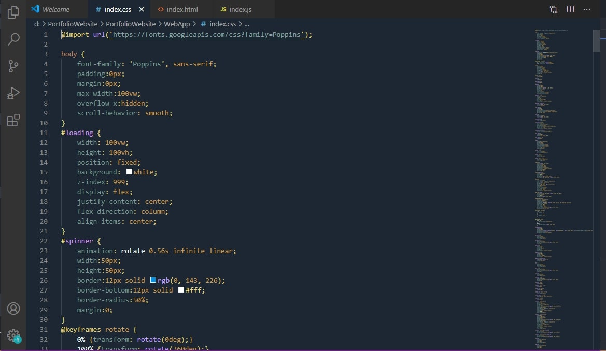
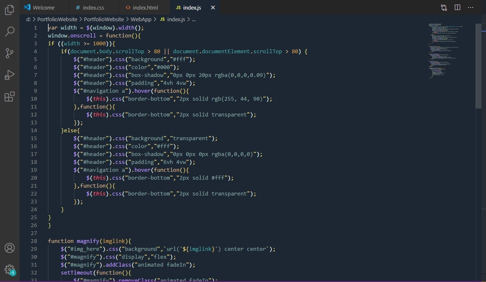

# Carnival 🌌

A Visual Studio Code theme for the "believer in you" is out there. Fine-tuned for those of you for whom coding is like a carnival and this extension will add more colors of joy and satisfaction to your dev life. Color choices have taken into consideration what is accessible to people who love to code with a dark theme. Decisions were also based on meaningful contrast for reading comprehension and for optimal razzle dazzle. Happy Coding! ✨

## Carnival

# Installation

1.  Install [Visual Studio Code](https://code.visualstudio.com/)
2.  Launch Visual Studio Code
3.  Choose **Extensions** from menu
4.  Search for `night owl`
5.  Click **Install** to install it
6.  Click **Reload** to reload the Code
7.  From the menu bar click: Code > Preferences > Color Theme > **Carnival**

#### Dark Theme

Sublime code, Atom and other IDE to get this theme soon.

## Misc

Creating a theme for the first time, so if you see something missing, please feel free to [file an issue](https://github.com/prantikc22/carnival-theme/issues)! 

Any relevant changes for each version are documented in the changelog. Please update and check the changelog before filing any issues, as they may have already been taken care of.
